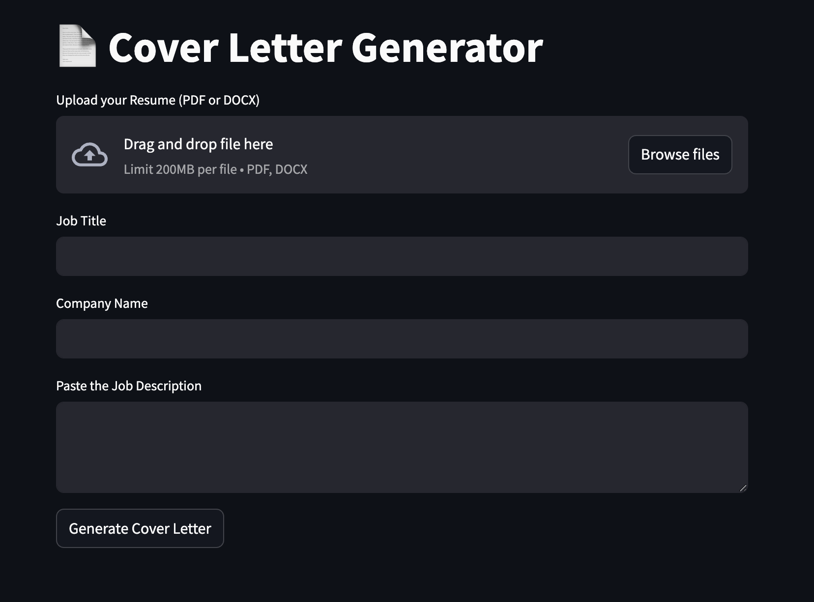

# Cover Letter Generator

Welcome to the **Cover Letter Generator** repository! This project is a lightweight, AI-powered web app that helps users create personalized, professional cover letters. By uploading a resume and entering job-specific details, the app generates a tailored cover letter using **LLaMA 3.2 running locally** — no internet or API keys required.



## Table of Contents

- [Features](#features)
- [Tech Stack](#tech-stack)
- [Architecture](#architecture)
- [Installation](#installation)

## Features

- **Resume Parsing**
  - Supports `.pdf` and `.docx` resume uploads.
  - Automatically extracts and formats resume content.

- **Cover Letter Generation**
  - Uses local LLaMA 3.2 LLM for generating cover letters.
  - Tailors content based on:
    - Job Title
    - Company Name
    - Job Description

- **Streamlit Web Interface**
  - Clean, responsive UI for a smooth user experience.
  - Text preview of generated cover letters.
  - Copy and reuse output instantly.

- **Private & Local**
  - No external API calls or cloud storage.
  - All processing happens on your machine.

## Tech Stack

- **Frontend/UI:** Streamlit
- **AI Model:** LLaMA 3.2 (running locally)
- **Document Parsing:** 
  - `pdfplumber` for PDF resumes
  - `docx2txt` for Word resumes
- **Language:** Python 3.8+

## Architecture

This project follows a modular architecture:

- **UI Layer:** Built with Streamlit, collects user inputs and displays output.
- **Resume Parser:** Extracts raw text from uploaded files.
- **Prompt Engine:** Constructs structured prompts for LLaMA.
- **LLM Backend:** LLaMA 3.2 handles natural language generation locally.

## Installation

1. Clone the repository:
   ```bash
   git clone https://github.com/mohamedzeina/cover-letter-generator.git
   cd cover-letter-generator
   ```
   
